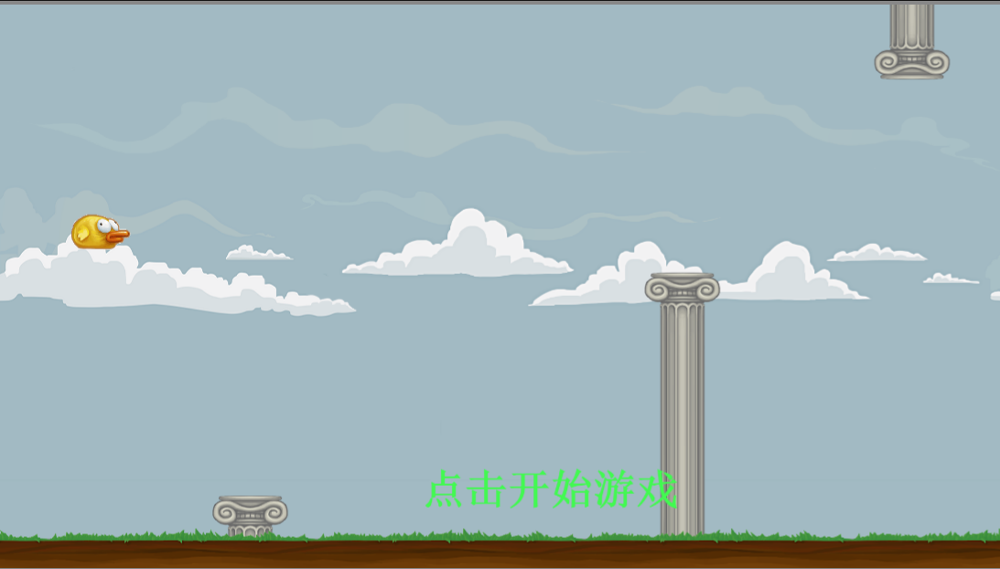
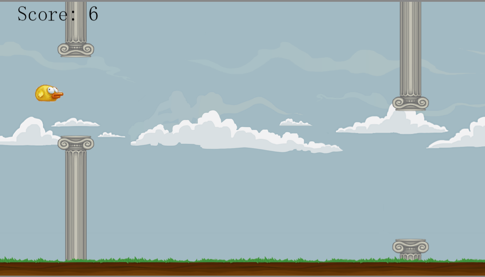
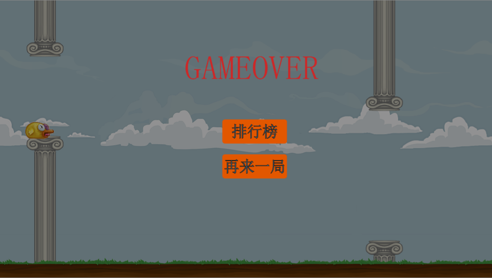
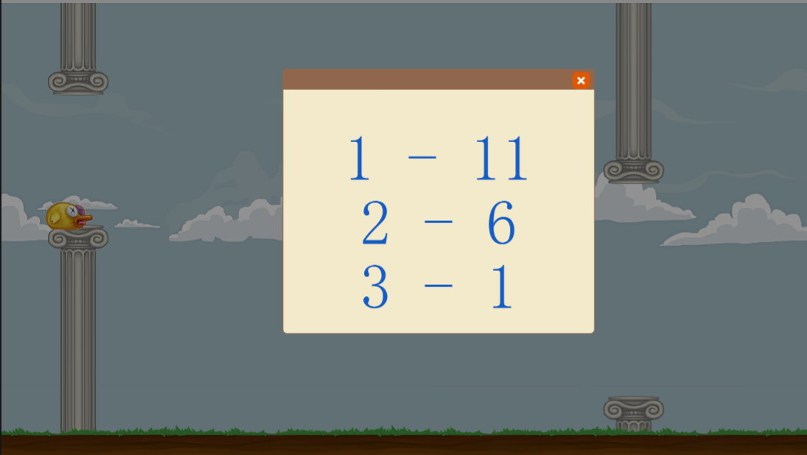

# Flappy Bird

## 这是什么

这是基于layaAir3.14版本游戏引擎，实现的经典游戏FlapperyBird。

参考了siki学院的[LayaAIr2D入门案例 - FlappyBird](https://www.sikiedu.com/my/course/582)

原视频是使用的layaAir2引擎实现，此项目使用layaAir3在复现的过程中，使用git记录了每一节视频的内容，可供学习参考。从而通过layaAir2版本的视频教程入门layaAir3引擎。

原来项目对动画的实现，我是用了自己的方式进行实现，因为原来的动画接口我没有找到。

## 内容截图

